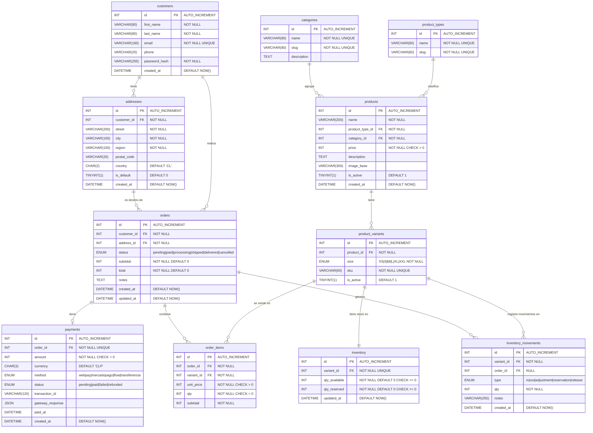

# Diagrama ER — Unicorn't Store

> Motor: MySQL 8.0+  
> Fecha: Marzo 2026  
> Notación Mermaid `erDiagram` (crow's foot)



---

## Notas sobre el modelo

| Decisión | Justificación |
|----------|---------------|
| `product_types` separado de `categories` | El tipo (Polera/Tazón) y la temática (devops/linux/…) son dimensiones ortogonales. Permite agregar nuevos tipos sin tocar la jerarquía temática. |
| `product_variants` con `size` | Las poleras tienen tallas físicas; el stock y el SKU son por variante, no por producto. |
| `inventory` (snapshot) + `inventory_movements` (log) | El snapshot permite consultas de stock O(1). El log permite auditoría completa, reposiciones y reconciliación. |
| `addresses` tabla separada | Historial de envíos, múltiples domicilios por cliente, `is_default` para precarga en checkout. |
| `unit_price` capturado en `order_items` | El precio al momento de compra no debe cambiar si el producto se modifica después. |
| `payments.gateway_response` tipo JSON | Respuestas de Webpay/MercadoPago/Flow son estructuras variables; JSON nativo de MySQL 8 evita columnas nulas innecesarias. |
| Precios en `INT` (CLP) | El peso chileno no usa decimales significativos; `INT` es suficiente y evita errores de punto flotante. |
```
