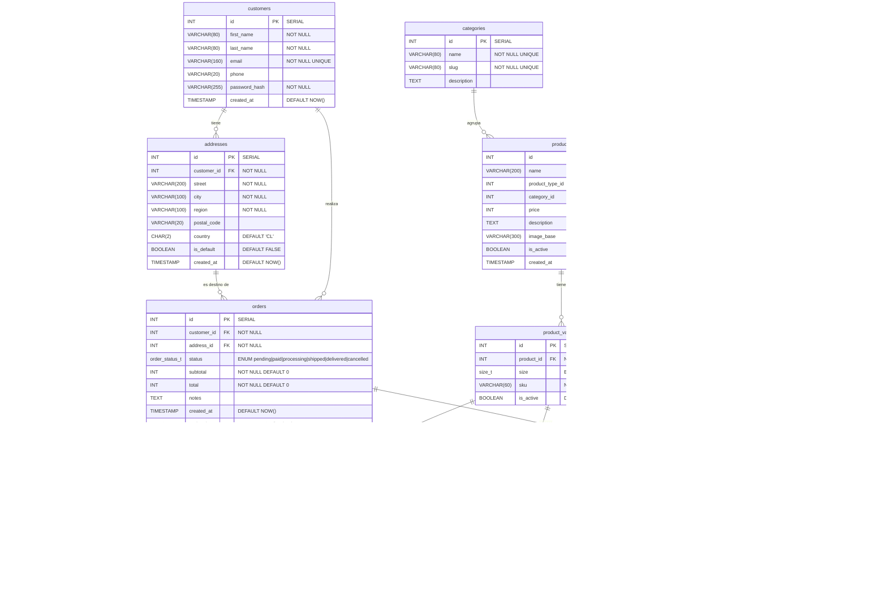

# Diagrama ER - Unicorn't Store

> Motor: PostgreSQL 15+  
> Fecha: Marzo 2026  
> Notación Mermaid `erDiagram` (crow's foot)

---

## Diferencias con la versión MySQL

| Elemento | MySQL | PostgreSQL |
|----------|-------|------------|
| `ENUM` | Tipo nativo inline | `CREATE TYPE name AS ENUM (...)` - tipo reutilizable |
| Booleanos | `TINYINT(1)` | `BOOLEAN` nativo (`TRUE`/`FALSE`) |
| JSON | `JSON` | `JSONB` (binario, indexable con GIN) |
| `DATETIME` | `DATETIME` | `TIMESTAMP` |
| `updated_at` automático | `ON UPDATE CURRENT_TIMESTAMP` | Trigger `BEFORE UPDATE` con función `set_updated_at()` |
| Autoincremento | `AUTO_INCREMENT` | `SERIAL` |
| Enteros sin signo | `INT UNSIGNED` | `INT` + `CHECK (col >= 0)` |
| Búsqueda full-text | `FULLTEXT INDEX` | `GIN` index sobre `to_tsvector(...)` |
